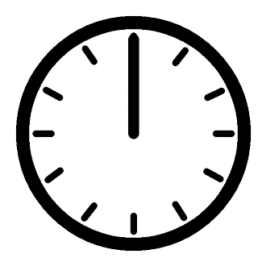

# BeyondTimeZones par ***Efflam*** et ***Nicolas*** 
Site qui permet de connaître l'heure qui l'est en dehors des fuseaux horaires.
___
## Fonctions nécessaires
1. fonction qui rend la longitude de l'utilisateur - *avec javascript*
2. fonction qui rend avec la longitude l'écart en seconde avec la longitude de Greenwich (UTC) - *avec php*
3. fonction qui converti des secondes en format Heures:Minutes:Secondes dans un tableau - *à voir*
4. fonction qui rend la valeur du fuseau horraire de l'utilisateur (ex: pour GMT+8, il rend 8) 
5. fonction qui actualise une partie de la page
6. fonction qui récupère l'heure de la machine de l'utilisateur
7. fonction qui vérifie la validitée de la longitude [-180;180]
8. 
___
## Répartition des tâches actuel
- Efflam :
- [x] Fonction n°2, elle est constituée de ecartSeconde(longitude)
- [x] Fonction n°3, elle est constituée de conversionHMS_objects(temps) et conversionHMS(temps)
- [x] Fonction n°7, elle est constituée de verifLongitude(longitude)
- [ ] Fonction n°4
- Nicolas :
- [x] Fonction n°1, elle est constituée de getLocation() et getLongitude(position).
- [x] Fonction n°6, elle est constituée de heure()
- [ ] Fonciton n°5
___
## Problèmes
- Implémentation de l'actualisation des heures - à voir
___
## Le Cahier des charges
*Projet Heure_Reelle.pdf* => présentation du projet et des contraintes du projet
Le projet est un site web qui sera fait à l'aide d'html/css, du php et du javascript (si l'on en a besoin).
### Les fichiers qui forment le site :
  - la page d'**acceuil** qui présentera le formulaire en charge de récupérer les informations nécessairent pour le traitement des données
  - la page de **traitement** des informations qui donnera au moins :
    - l'heure qu'il devrait être à la latitude récupérée
    - l'heure locale de l'utilisateur
    - la différence de temps entre ces deux heures
    - *plus à déterminer*
  - le fichier **css** qui regroupera les styles 
  - *si le temps nous le permet, d'autres pages pourront être ajoutées*
___
## Les étapes à suivre
1. 1re Etape
   - Création des fichiers essentiels du projet :
     - la page d'**acceuil** : *acceuil.html*
     - la page de **traitement** : *traitement.html*
     - le fichier **css** : *style.css*

___
 
